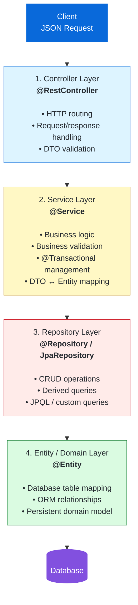

# 🏢 EmployeeDiary Microservice

[](https://www.oracle.com/java/)
[](https://spring.io/projects/spring-boot)
[](#)
[](#)

A production-ready **Spring Boot microservice** built following **Layered (N-Tier) Architecture** to handle employee lifecycle operations. It exposes RESTful APIs for creating, fetching, and filtering employee records, backed by **MySQL** for persistence and an in-memory **H2 Database** for isolated unit and integration testing.

---

## 🛠️ Tech Stack

- **Language & Runtime:** Java 17
- **Framework:** Spring Boot 4.x (Spring Web, Spring Data JPA)
- **Persistence & Database:** MySQL (Runtime/Dev), Hibernate, In-Memory H2 (Testing)
- **Testing:** JUnit 5 (Jupiter), Mockito, MockMvc, Spring Test Suite Engine
- **Productivity & Utilities:** Project Lombok, Jackson ObjectMapper
- **Build Tool:** Maven

---

## 🏛️ Architecture & Data Flow

This project follows a strict **Layered Architecture (Controller-Service-Repository Pattern)** to decouple transport, business rules, and persistence concerns:


## Architecture

The application follows a layered Spring Boot architecture:




## 📂 Project Structure

```text
src
├── main
│   ├── java/com/example/EmployeeServiceApplication
│   │   ├── controller       # REST controllers exposing HTTP endpoints
│   │   ├── service          # Business logic interfaces
│   │   │   └── impl         # Service implementation & mappings
│   │   ├── repository       # Spring Data JPA repositories
│   │   ├── domain           # JPA Entities (@Entity, @Table)
│   │   └── dto              # Request and Response transfer models
│   └── resources
│       └── application.properties
└── test
    └── java/com/example/EmployeeServiceApplication
        ├── controller_test  # Web slice tests (@WebMvcTest)
        ├── service_test     # Pure Mockito tests (@ExtendWith)
        ├── repository_test  # Database slice tests (@DataJpaTest)
        └── suite            # Aggregated test suite runner (@Suite)

## **Running Tests**

# Run all tests
mvn test

# Run the complete test suite
mvn test -Dtest=EmployeeServiceTestSuite

## **Build and Run**
mvn clean install
mvn spring-boot:run
